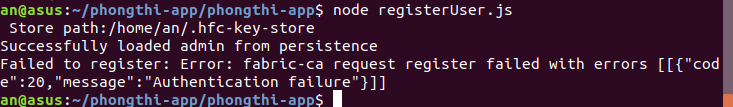
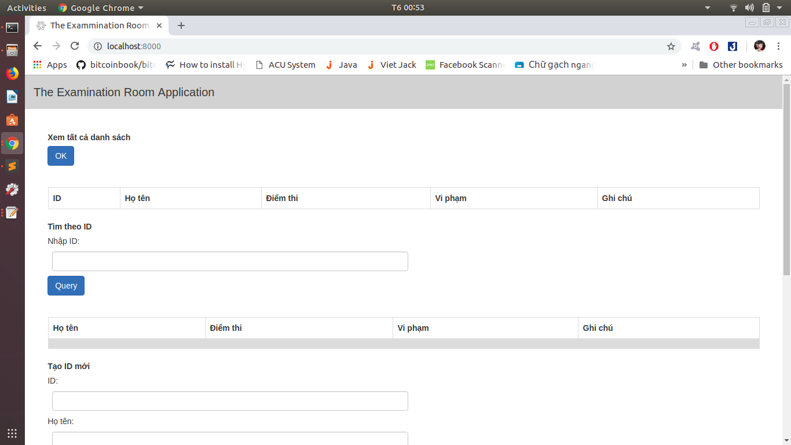
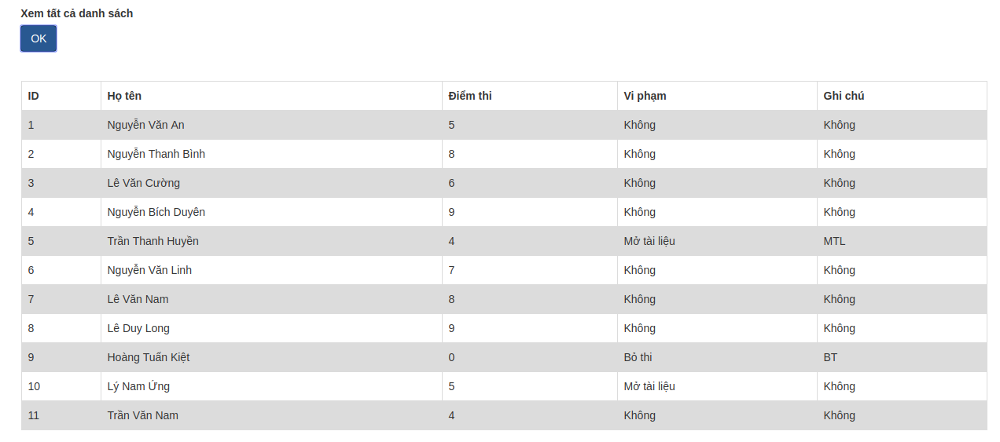
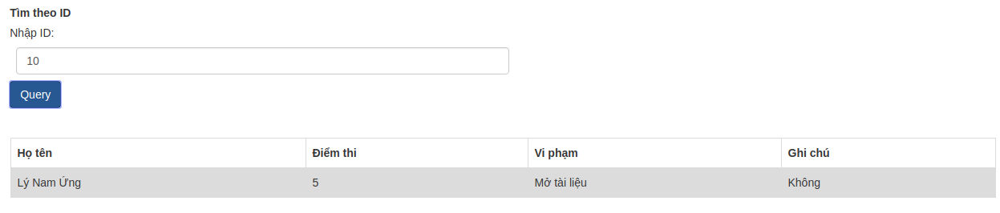
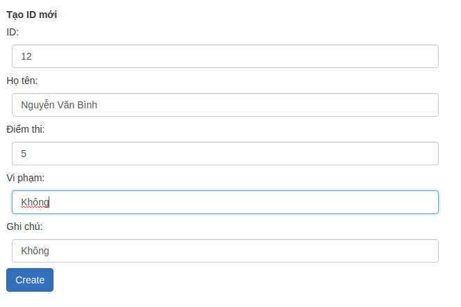
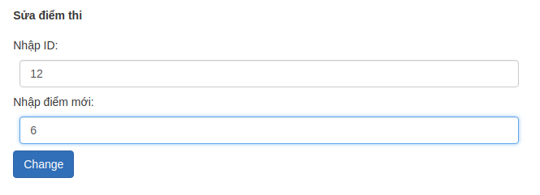

# Hệ thống Quản lý phòng thi

@20150016 Trần Văn An

## Mục tiêu
- Quản lý các thông tin của thí sinh: ID, Họ và tên, Điểm thi, Vi phạm khi thi
- Tìm thông tin của thí sinh theo ID
- Thêm thí sinh vào danh sách phòng thi
- Sửa điểm của thí sinh
## Công nghệ sử dụng
- Hyperleger Fabric.
- Hyperledger Frabric NodeJS SDK.
- JavaScript
## Hướng dẫn cài đặt
Hướng dẫn cài đặt trên hệ điều hành ubuntu 18.04 LTS:

### Cài đặt môi trường và công cụ hỗ trợ
#### Golang
**Yêu cầu Golang phiên bản 1.9.x hoặc mới hơn**.

  Cách cài đặt
  Ta nên cài đặt Go vào thư mục ~/
  Chuyển về thư mục ~/
```
cd ~/
```
  Tải Go phiên bản mới nhất từ Google bằng lệnh
```
wget https://dl.google.com/go/go1.11.4.linux-amd64.tar.gz
```
  Giải nén bằng lệnh
```
tar xvzf go1*.tar.gz
```
  Thiết lập GOPATH bằng cách thêm vào file ~/.bashrc lệnh dưới đây:
```
export GOPATH=$HOME/go
export PATH=$PATH:$GOPATH/bin
```
#### Cài đặt libltdl-dev:
```
sudo apt install libltdl-dev
```
#### Cài đặt Docker
- Cài đặt docker-ce bản mới nhất 18.03.1 cho Ubuntu 18.04
```
wget https://download.docker.com/linux/ubuntu/dists/bionic/pool/stable/amd64/docker-ce_18.03.1~ce~3-0~ubuntu_amd64.deb
sudo dpkg -i docker*.deb
sudo apt install -f
```
- Thêm người dùng vào nhóm docker bằng lệnh:

```
sudo usermod -aG docker USERNAME
```
  Trong đó: USERNAME là tên thật của người dùng
  Đăng xuất và đăng nhập lại. Để xác minh rằng Docker đang làm việc bạn chạy lệnh:

```
docker run hello-world
```
#### Cài đặt Pip
- Cài đặt Pip bằng lệnh
```
sudo apt install python-pip
```
#### Docker-Compose
**Yêu cầu dokcer-compose phiên bản 1.8 hoặc mới hơn**.

Docker-Compose cho phép ta dễ dàng quản lý được nhiều containers một lúc. Ta cài đặt bằng Pip
```
sudo pip install docker-compose
```
Để kiểm tra phiên bản doker-compose ta dùng lệnh
```
docker-compose --version
```

#### Cài đặt Git và Curl
- cURL là công cụ giúp chuyển dữ liệu: từ server đến đâu đó và ngược lại, hỗ trợ nhiều giao thức (FTP, FTPS, HTTP, HTTPS,...).
```
sudo apt install git curl
```
#### Cài đặt Samples, Binaries và Docker Images
- Hyperledger cung cấp 1 bản Sample để ta có thể build 1 mạng blockchain đơn giản
  Tạo thư mục chứa Fabric Samples
```
mkdir -p $GOPATH/src/github.com/hyperledger/
cd github.com/hyperledger 
git clone https://github.com/hyperledger/fabric-samples.git
```
-  Cài đặt các Binaries và Docker Images:
```
curl -sSL http://bit.ly/2ysbOFE | bash -s 1.4.0
```
### Cài đặt Hệ thống Quản lí phòng thi

- Di chuyển đến Project Phòng thi. Trong trường hợp này là ở ~/phongthi-app

## Hướng dẫn sử dụng
- Di chuyển đến thư mục phongthi-app
```
cd phongthi-app
```
- Chạy Script khởi động mạng

```
./startFabric.sh
```
- Đăng kí Admin:

```
node registerAdmin.js
```
- Đăng kí User
```
node registerUser.js
```
- Nếu xảy ra lỗi



- Xóa thư mục chứa key và đăng kí Admin, User lại

```
rm ~/.hfc-key-store/*
node registerAdmin.js
node registerUser.js
```
- Chạy server
```
node server.js
```
- Vào trình duyệt nhập địa chỉ http://localhost:8000/ để vào trang chủ.



Để lấy danh sách thí sinh trong phòng, sử dụng chức năng "Xem danh sách thí sinh"



Để xem thông tin của một thí sinh ta sử dụng tìm kiếm theo ID



Để tạo thông tin cho một thí sinh mới, sử dụng chức năng "Tạo ID mới"



Để sửa điểm của một thí sinh, sử dụng chức năng "Sửa Điểm thi"




## Demo video


